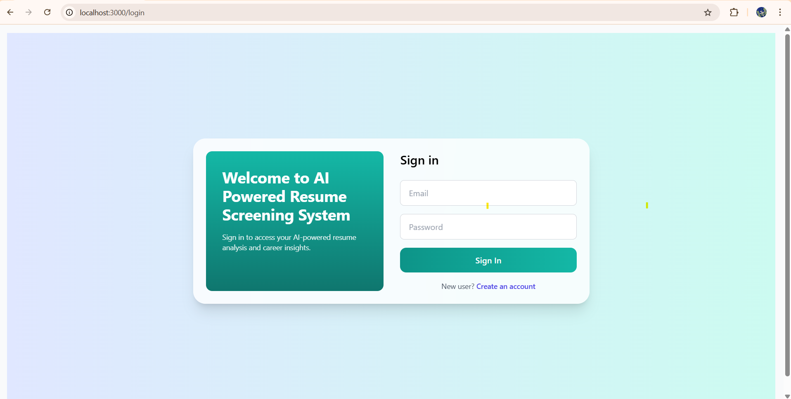
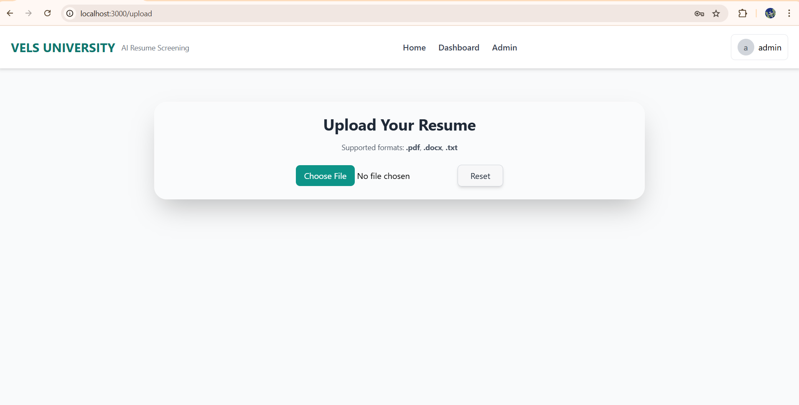
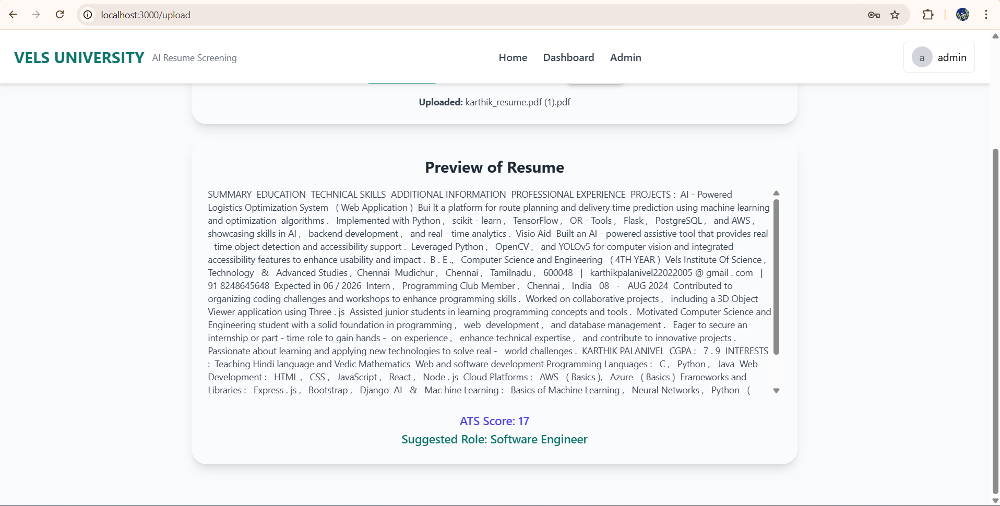
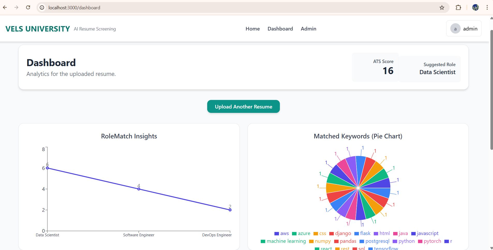
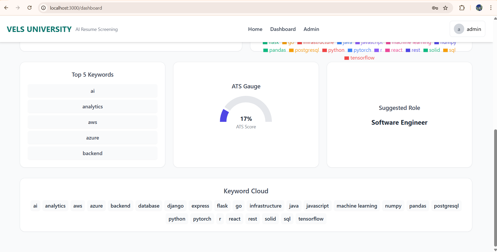

# 🤖 AI-Powered Resume Screening System

A full-stack AI-enabled platform to **automate resume screening, scoring, and ranking** based on job descriptions.  
This repository integrates three major components: a React frontend, a Spring Boot backend API, and an AI service using FastAPI — forming a complete, scalable, end-to-end solution.

---

## 🔍 Project Overview

This system is designed to help recruiters and HR teams:

- Automate resume evaluation
- Extract insights using AI/ML models
- Match resumes to job descriptions
- Rank candidates based on relevance scores

It eliminates manual efforts and accelerates hiring decisions with AI-driven accuracy.

---

## 📂 Repository Structure
AI-Powered-Resume-Screening-System/
├── frontend/ # React frontend application
├── backend_visualflow/ # Spring Boot backend API
├── ai-service_visualflow/ # FastAPI AI / ML scoring engine
├── .gitignore
├── img1.png … img5.png # Screenshots
└── README.md


🔹 **Frontend**: User interface built using React.  
🔹 **Backend**: API to coordinate frontend & AI service.  
🔹 **AI Service**: Handles resume parsing, AI scoring & ranking.

---

## 🚀 Features

### ⭐ General
- Upload resumes (PDF/DOCX)
- Enter job description
- Automated scoring and ranking
- React dashboard with results

### ⚙️ Tech Stack
| Layer | Technology |
|-------|------------|
| Frontend UI | React, Tailwind CSS |
| Backend API | Java Spring Boot |
| AI Service | Python FastAPI |
| Data Processing | NLP / ML Models |
| Deployment Ready | Docker / Cloud |

---

## 🖼 Screenshots

### 📌 UI Previews

#### 🔹 Dashboard & Ranking


#### 📄 Resume Upload Screen


#### 📊 Ranked Results


#### 🧠 AI Scoring Output


#### 📈 Comparison & Insights


---

## 🛠 Setup & Installation

### 1️⃣ Clone the Repo
```bash
git clone https://github.com/Dhanushk1104/AI-Powered-Resume-Screening-System.git
cd AI-Powered-Resume-Screening-System
cd backend_visualflow
mvn clean install
mvn spring-boot:run
cd ai-service_visualflow
pip install -r requirements.txt
uvicorn main:app --reload
cd frontend
npm install
npm start

